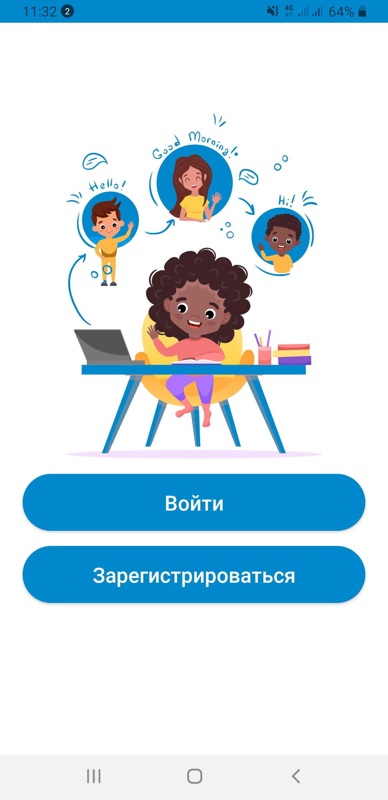
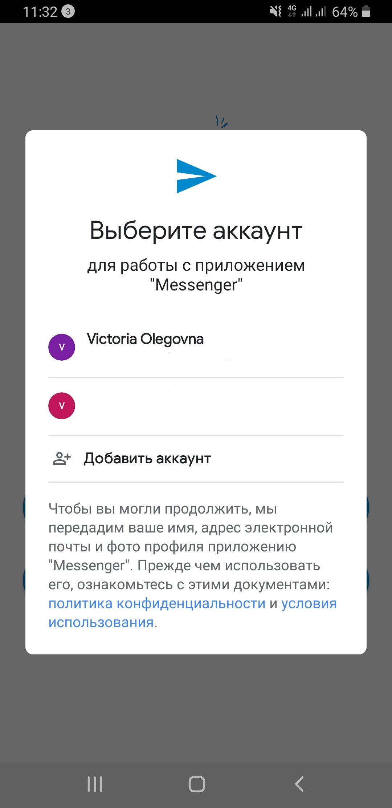
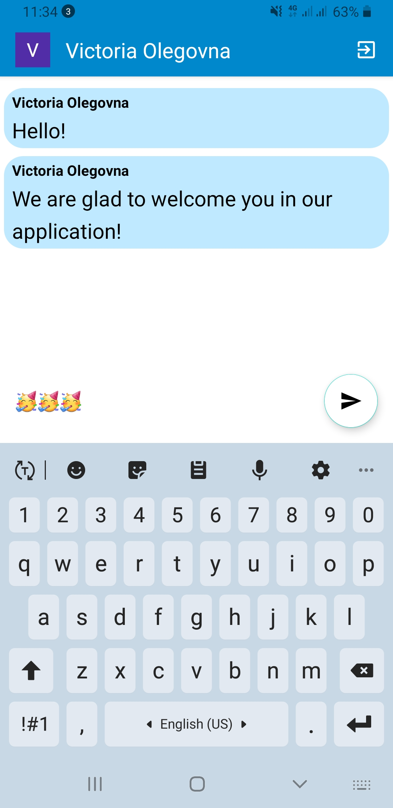

# Messenger

Messenger - Mobile application for communication with family and friends, as well as colleagues at
work, study and in general for the convenience of communication with people.

## Screenshots

	
	
	

## Initial project setup

To start the project, you need to copy the project link
https://github.com/VictoriaRydina/FriendlyChat.git and open a new project in Android Studio using it

## Open the project in Android Studio

Open Android Studio, make sure you are on the development branch and then in the top right corner
click on the “Sync Project with Gradle Files” icon or in the top left corner “File” -> “Sync Project
with Gradle Files”

## Technologies

* Kotlin
* Firebase
* Picasso
* Dagger 2
* Clean Architecture
* MVVM
* Kotlin Coroutines
* Retrofit2

## The project status

The project is under active development!
